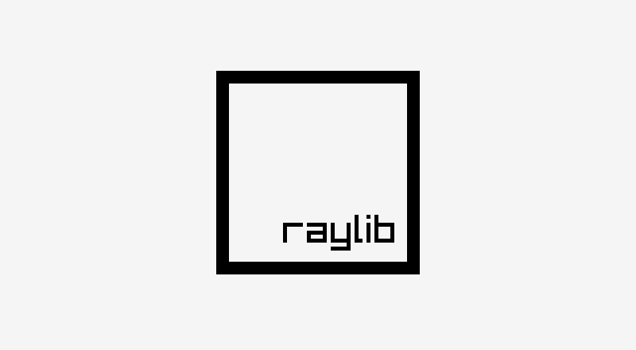

# Lessons of raylib Introduction Course (pascal version) 

Examples of classes from the [Ramon Santamarina](https://twitter.com/raysan5) - [raylib](http://www.raylib.com/) (https://github.com/raysan5/raylib-intro-course)[Introduction Course].

Dependencies: [Ray4Laz](https://github.com/GuvaCode/Ray4Laz)

